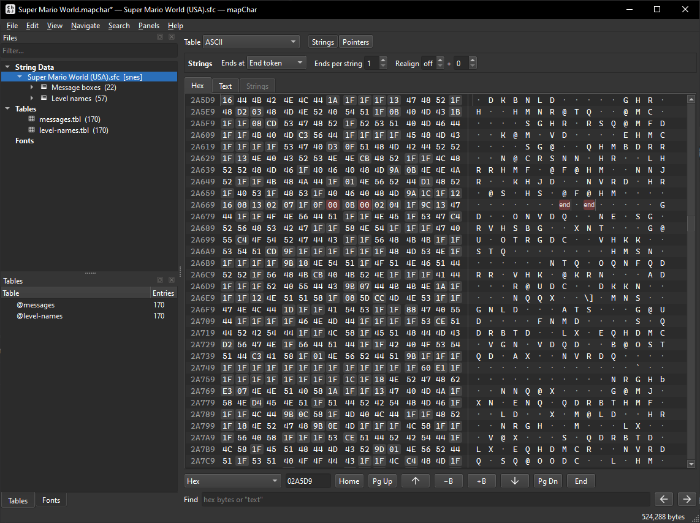
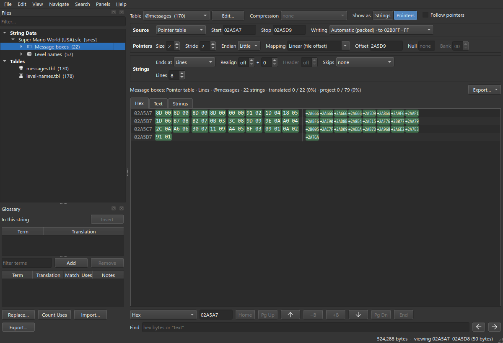
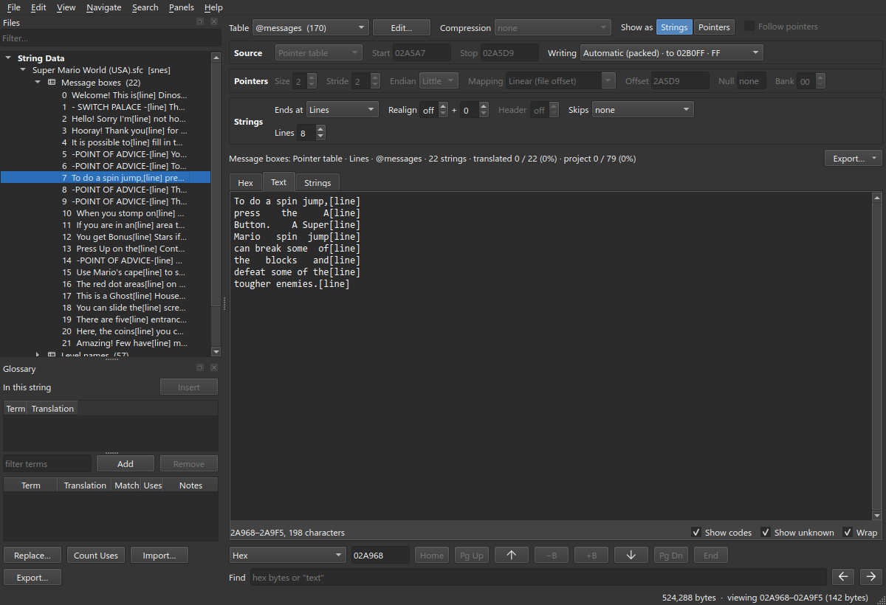
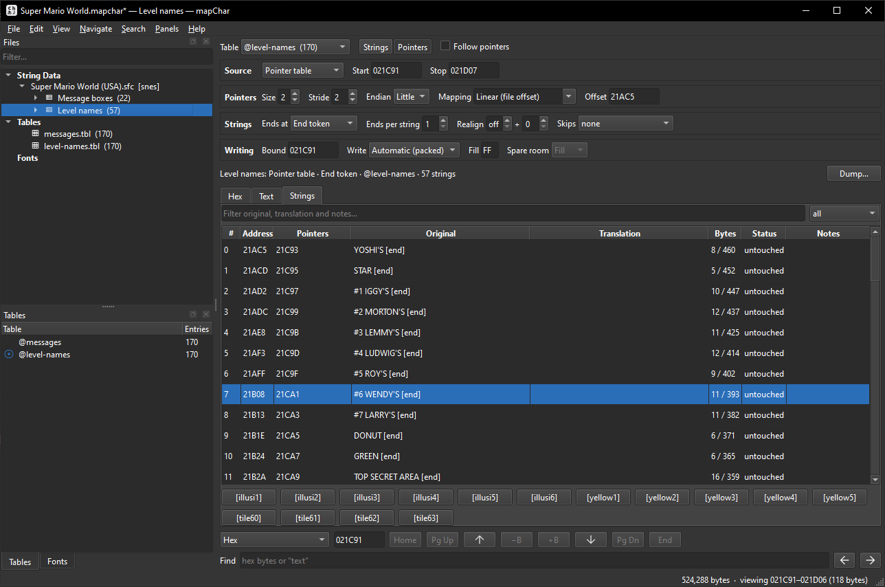
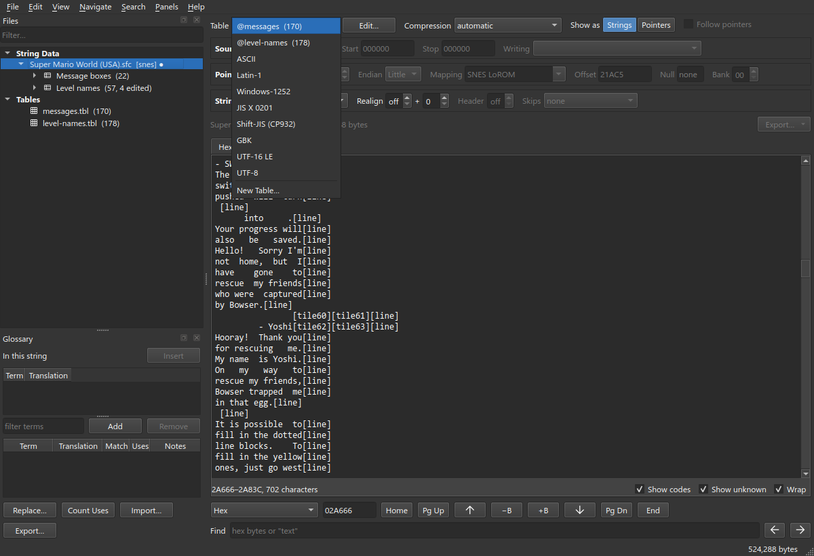
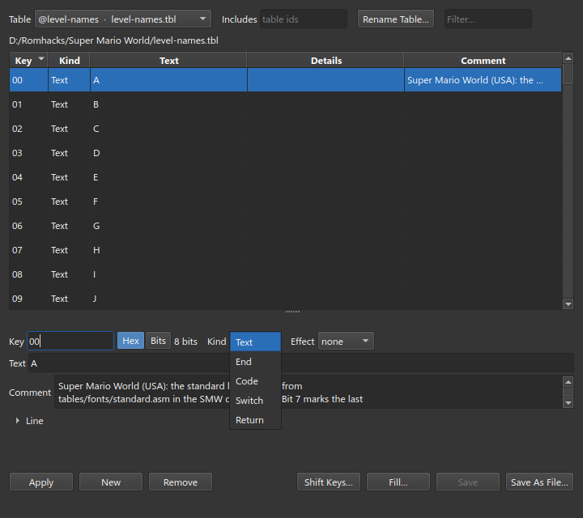

# mapChar

**mapChar** is a cross-platform text viewer and editor for romhacking and translation
projects.

If you run into issues or have questions. Submit a github issue or reach out to me (Epi)
on Discord through the https://romhack.ing/ Discord server.

mapChar is built on Python + Qt (PySide6) and runs on Windows, macOS, and Linux.

| | | |
|:-:|:-:|:-:|
|  |  |  |
| Exploring a ROM | Blocks & pointer tables | Decoded text |
|  |  |  |
| Translating strings | Tables & charsets | Table editor |

## Features

- **Table files** - define how bytes map to characters.
- **Charsets** - a wide variety of built in charsets.
- **Blocks** - save a region with a particular configuration, containing a block
  of individual strings.
- **Pointers** - strings can be represented either as a chunk of data or pointers
  to the string data.
- **Finding text** - relative search with case gaps, wildcards and kana runs
  that seeds a table from a hit, and a scan that scores the file for
  text-likeness and offers the regions it finds as blocks.
- **Editing** - translations edited beside the original with code completion,
  live byte counts against the room available, filters, find and replace across
  a project, and undo across everything. Every edit goes straight into the
  ROM's bytes; the project keeps each string's original.
- **Writing back** - packed or slotted layout, fill bytes, bounds, and undo.
- **Compression** - various built in compression formats that work as part of the
  editing pipeline.
- **Containers** - various built in container plugins for working with different
  file types.
- **Preview** - strings rendered through a font sheet into a text box, showing
  how they lay out on screen, with wrapping that fits a translation to the box.
- **Dump, export and import** - a native script format, TSV, CSV and PO for
  translators, and Cartographer and Atlas command files both ways.
- **Plugin system** - containers, compression, charsets and mappings as TOML
  presets or Python code, per machine or carried with a project.
- **Projects** - session can be saved as a `.mapchar` file and picked up later.

## Getting Started

### Install

Grab the build for your platform from the [Releases page](https://github.com/YoriKv/mapchar/releases), unpack and run, no installer.

### First steps

1. **Open a file** - File -> Open ROM, or drag a ROM/binary onto the window.
2. **Find the text** - scroll the raw view, type in an offset, or use Search to find
   where the strings are.
3. **Get a table** - load a `.tbl` file, build one yourself, or pick one of the built-in charsets.
4. **Make a block** - File -> New Block over the strings, set how they are
   parsed and if it's a pointer table.
5. **Translate** - edit translations in the Strings view or dump a script and import it back.
   Each edit rewrites the bytes in memory, so what you see is what the ROM will hold.
6. **Write/Save** - write the file back to disk. Save your project session to
   resume later: it is what remembers the original text once the ROM is written.

Help -> Shortcuts (`F1`) to view a list of keyboard shortcuts.

## Thank You

Thanks to the following projects that I used as reference for this tool. No code was
copied or used from these projects directly.

- **[Cartographer](https://www.romhacking.net/utilities/647/)**
- **[Atlas](https://www.romhacking.net/utilities/224/)**
- **[abcde](https://www.romhacking.net/utilities/1392/)**
- **[romjuice](https://www.romhacking.net/utilities/234/)**

## AI Use Disclaimer

This tool was created with the help of an AI coding agent. All of the code and
some of the tooltips are AI generated, but the design and other aspects of this
project are my own.
