# Advanced Pointers

This page covers three pointer layouts that the
[Getting Started](Getting-Started) tutorial does not:

1. Pointers that are inside code.
2. One pointer that reaches several strings.
3. Pointers into length-prefixed records.

It uses the same ROM and project. Select **@mk2** in the **Table** list for
every step.

## 1. Pointers inside code: Link

In the **Text** tab, find `"PLAYER 1 HAS"`. Five link-cable messages are stored
together at `$83E0`.

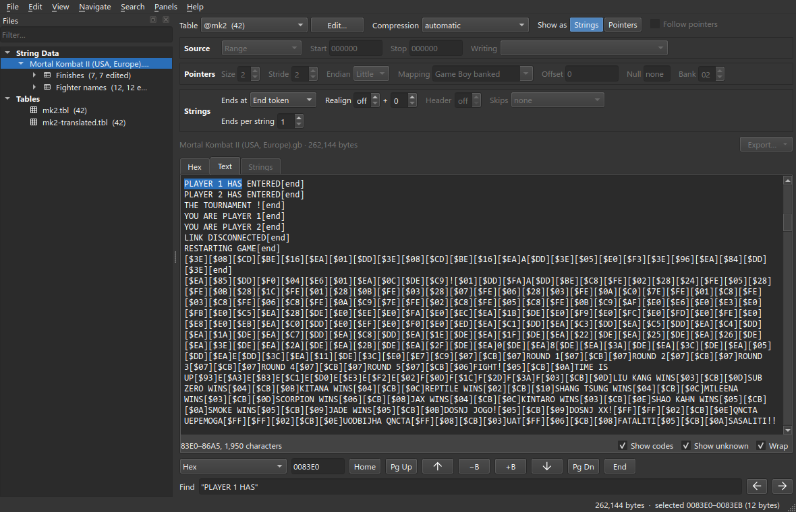

These messages have no pointer table. The game loads the address of each
message into a register, then calls the print routine:

```
21 E0 43     ld hl,$43E0     ; PLAYER 1 HAS ENTERED
```

`21` is the Game Boy instruction *load HL*. The two bytes after it are a normal
pointer, low byte first. The messages are in bank 2, so the value `$43E0` is
file offset `$83E0`.

To find the pointer to a string, search for `21` followed by the address of the
string, low byte first. In the **Hex** tab, find `21 E0 43`:

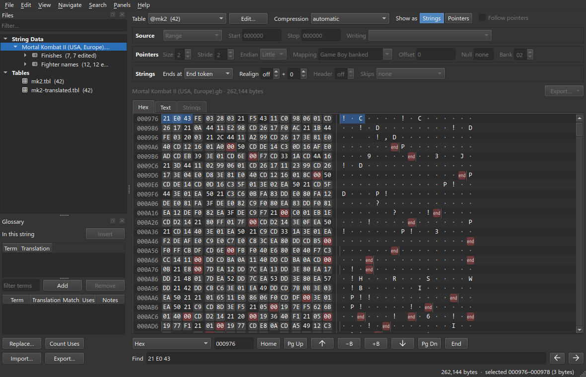

The match is at `$976`, so the pointer is at `$977`. Repeat the search for each
string:

| String | Address | Find | Pointer |
| --- | --- | --- | --- |
| PLAYER 1 HAS ENTERED | `$83E0` | `21 E0 43` | `$977` |
| PLAYER 2 HAS ENTERED | `$83F5` | `21 F5 43` | `$97E` |
| THE TOURNAMENT ! | `$840A` | `21 0A 44` | `$989` |
| YOU ARE PLAYER 1 | `$841B` | `21 1B 44` | `$994` |
| YOU ARE PLAYER 2 | `$842C` | `21 2C 44` | `$99B` |

There is code between the five pointers, so a **Pointer table** cannot read
them. A **Pointer list** can. A pointer list holds the address of each pointer.

1. Set **Show as** to **Pointers**.
2. Select the two bytes at `$977` to `$978`.
3. Choose **New Block** and rename the block to `Link`. The block is a pointer
   table with one pointer.
4. On the Reading bar, set **Source** to **Pointer list**.
5. Open **Addresses**. Each row of the list is one address. **Add** adds a row.
   **Remove** deletes the selected row.
6. Type all five addresses into one row, separated by commas. mapchar puts each
   address in its own row:

```
$977, $97E, $989, $994, $99B
```

| One pointer | The list | In Hex |
|:-:|:-:|:-:|
| [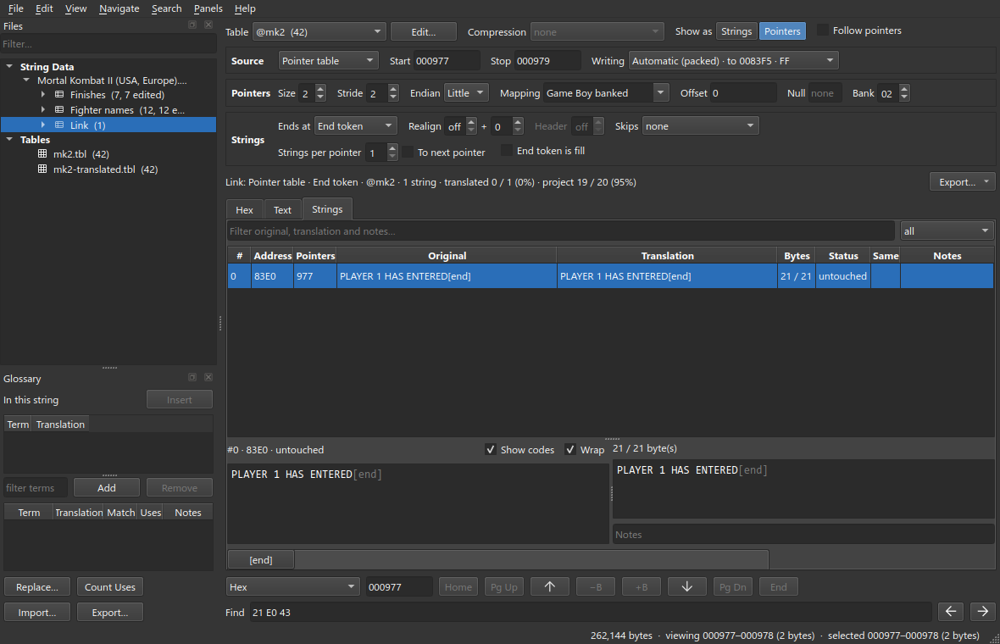](images/adv-1-one-pointer.png) | [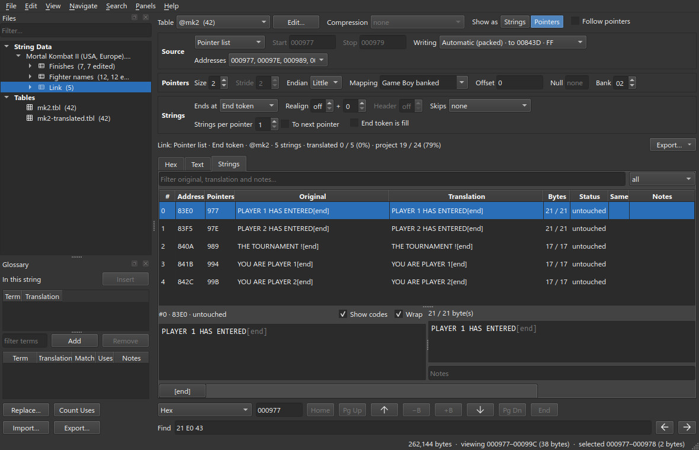](images/adv-1-link.png) | [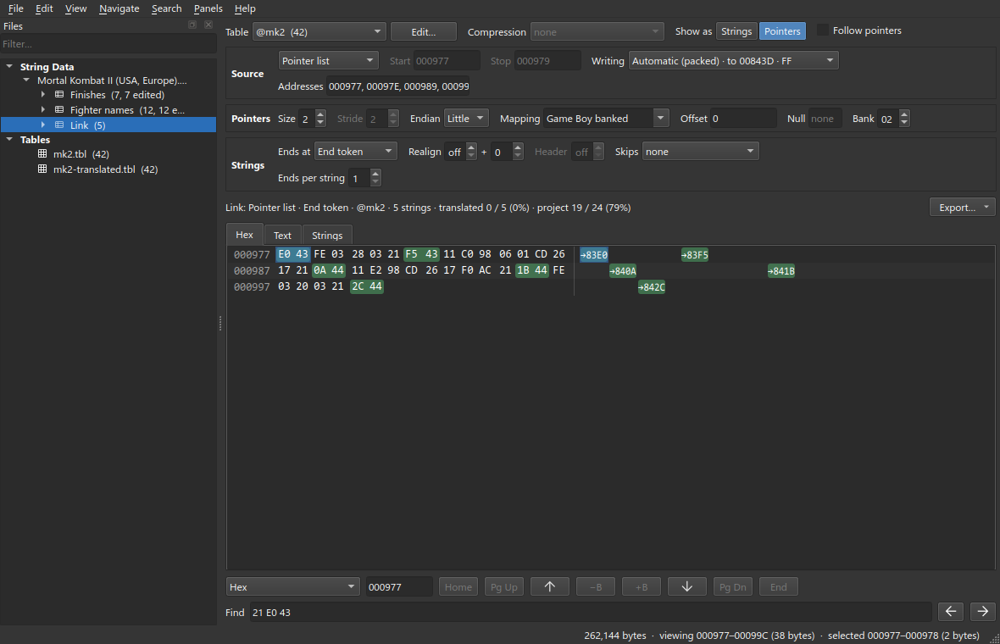](images/adv-1-link-pointers.png) |

The block is written **packed**, like every pointer block. The strings share
their space. When a string moves, mapchar rewrites the two pointer bytes inside
the instruction.

> Only the two bytes after `21` are the pointer. Check every address in the
> **Hex** tab. If an address is wrong by one byte, mapchar overwrites part of
> the instruction.

## 2. One pointer, several strings: Main menu

Find `"START GAME"`. It is at `$8141`. `OPTIONS` follows it at `$814C`.

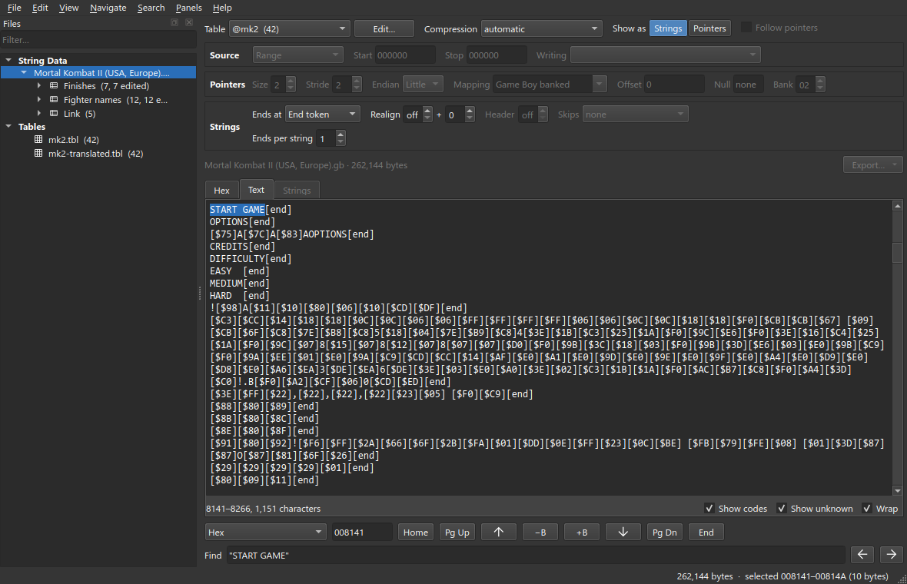

Find `21 41 41`. This is the pointer to `START GAME`, at `$310`. Find
`21 4C 41`. There is no match, because no pointer reaches `OPTIONS`. The print
routine stops at `00` and keeps its position at the next byte. The game prints
`OPTIONS` by calling the routine again without loading a new address.

Create a block over the pointer at `$310` to `$311`, as in step 1. Rename it to
`Main menu`. The block reads one string and stops at the first `[end]`. This
causes two problems:

- `OPTIONS` is not in the block.
- `START GAME` cannot become longer, because the space of the block ends at
  `$814C`, where `OPTIONS` starts.

Set **Strings per pointer** to 2. The pointer now reaches two strings. Each
string has its own row. Only the first row has the pointer.

| Strings per pointer 1 | Strings per pointer 2 |
|:-:|:-:|
| [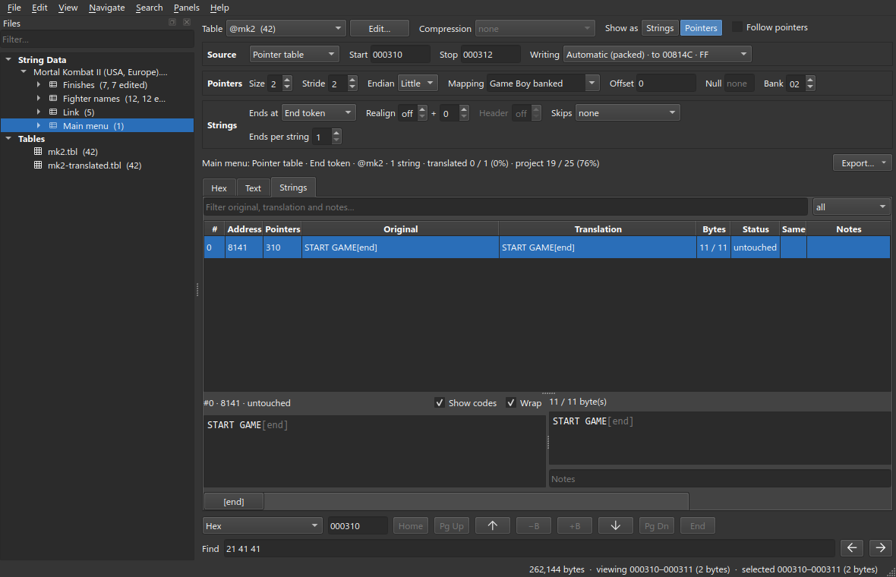](images/adv-2-one-end.png) | [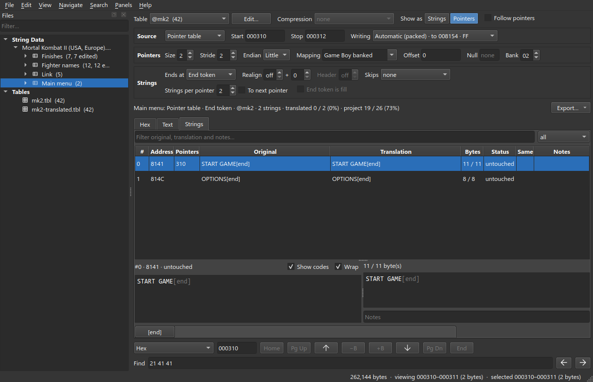](images/adv-2-two-ends.png) |

Translate each string separately. The two strings share their space, so one
can become longer when the other becomes shorter. `OPTIONS` is always written
directly after `START GAME`.

The options menu has the same layout with three strings. The pointer at `$367`
reaches `OPTIONS`, `CREDITS` and `DIFFICULTY`.

If a block has several pointers and each pointer reaches a different number of
strings, select **To next pointer**. The strings of each pointer then continue
up to the address of the next pointer. **Strings per pointer** then applies to
the last pointer only.

## 3. Pointers into records: Winners

The winner messages are records like the ones in
[Finishes](Getting-Started#4-a-strings-block-finishes): two position bytes, a
length byte, then the text. The game selects a message by fighter, so the
records also have a pointer table. The table is directly before the records, at
`$857B`. It holds twelve 2-byte pointers. The first pointer holds `$4593`,
which is file offset `$8593`.

Set **Show as** to **Pointers** and select `$857B` to `$8592`:

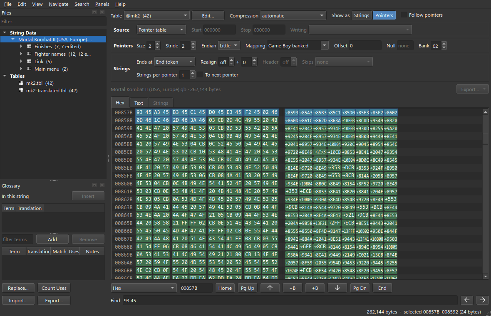

Choose **New Block** and rename the block to `Winners`. The records contain no
`00` byte, so each string continues through all the records after it.

Set **Ends at** to **Length prefix** and **Prefix** to 1. The strings are still
wrong:

```
03 CB   0D   4C 49 55 20 4B 41 4E 47 20 57 49 4E 53
pos     len  LIU KANG WINS
^ the pointer points here
```

Each pointer points to the start of its record, so the first position byte is
read as the length. A range block skips these bytes with **Header**. A pointer
block has no **Header** setting. Use **Offset** instead: set **Offset** to 2.
mapchar adds the offset to every pointer value, so each pointer now points to
its length byte.

| End token | Length prefix | Offset 2 |
|:-:|:-:|:-:|
| [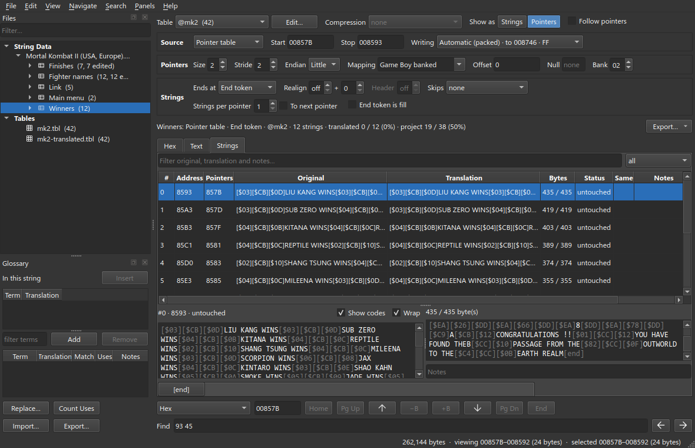](images/adv-3-no-offset.png) | [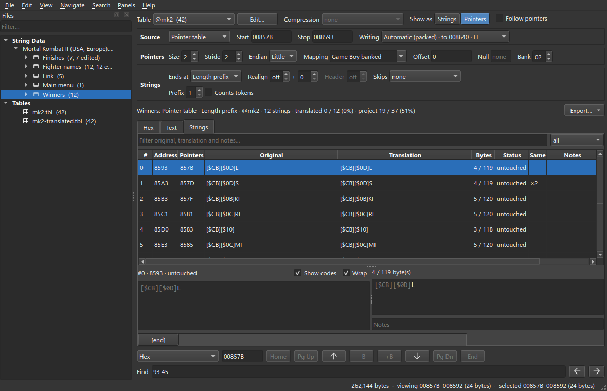](images/adv-3-length-prefix.png) | [](images/adv-3-offset.png) |

Change one more setting. A pointer block is written **packed** by default.
Packing writes each string directly after the previous one, which overwrites
the position bytes between them. Open **Writing** and set **Write** to
**Slotted**. Each string then keeps its address and its own space:

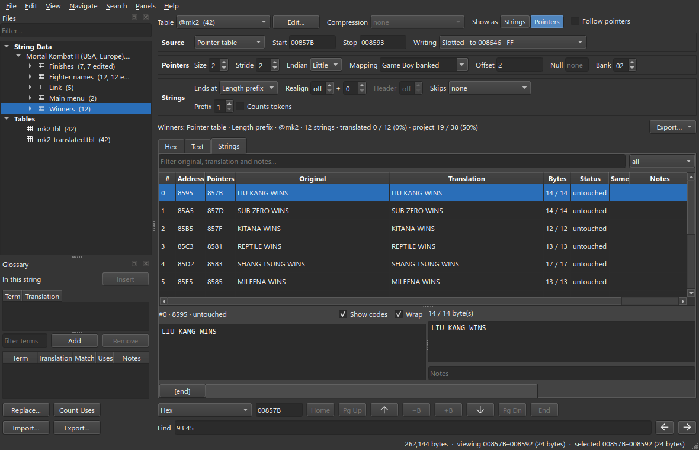

**Bytes** now shows `14 / 14` instead of space shared with the other records. A
translation can be shorter than the original, but not longer.
