# Getting Started

This tutorial takes a ROM from "never opened" to "two blocks of text translated
and written back". The game is **Mortal Kombat II** for the Game Boy
(`Mortal Kombat II (USA, Europe).gb`, CRC32 `BFAEADD0`), and the translation is
into Russian, so the last third of it is about a language the game's font was
never drawn for.

What it covers:

1. [Create the project and open the ROM](#1-create-the-project-and-open-the-rom)
2. [Build `mk2.tbl`](#2-build-mk2tbl)
3. [Look for text through the table](#3-look-for-text-through-the-table)
4. [A Strings block: Finishes](#4-a-strings-block-finishes)
5. [A Pointers block: Fighter names](#5-a-pointers-block-fighter-names)
6. [Hex, Text and Strings: three views of a block](#6-hex-text-and-strings-three-views-of-a-block)
7. [Build `mk2-translated.tbl`](#7-build-mk2-translatedtbl)
8. [Redraw the font](#8-redraw-the-font)
9. [Translate the strings](#9-translate-the-strings)
10. [Write the ROM](#10-write-the-rom)

Addresses are file offsets in hex, written `$8646`.

> **Work on a copy of the ROM.** mapchar writes translations into the ROM file
> itself, in place, and keeps no backup. Copy the ROM into a folder of its own
> first; the project and the table files go beside it.

---

## 1. Create the project and open the ROM

mapchar opens on an empty project. **File ▸ New Project** (Ctrl+N) gets you
back to one at any time.


**File ▸ Open ROM…** (Ctrl+Shift+O) — or a drop onto the window — adds the ROM
to the **Files** panel under *String Data* and shows its bytes in the **Hex**
tab. Then **File ▸ Save Project** (Ctrl+S) and save `MK2.mapchar` beside the
ROM. A project stores references and settings, never bytes: which files it
uses, the blocks you make, the original text of every string. The ROM stays
the ROM.


The right-hand column of the Hex tab is already text. A file with no table of
its own is read as **ASCII**, and at `$0134` the cartridge header spells
`MORTAL KOMBA…`, which is the first hint that this game stores its text as
plain ASCII codes.

## 2. Build `mk2.tbl`

A **table** says which bytes mean which characters. Everything else — finding
text, cutting it into strings, writing a translation — goes through one, so it
comes first.

### Finding out what the codes are

When a game's text is *not* ASCII, a **relative search** finds it anyway.
**Search ▸ Search Window…** (Ctrl+Shift+F), type a word you know is in the
game, and mapchar looks for bytes with the same *pattern* of distances between
letters, whatever the codes are.


`KITANA` turns up three times, and the **Bases** column says `upper=41`: the
capital letters start at `$41`, so `A` is `41`, `B` is `42` and so on —
ASCII, as the header suggested. **Build Table from Hit** would make a table
from that one fact; this tutorial builds it by hand instead, to show the Table
Editor.

### A new table

**File ▸ New Table…** asks where to save it. Name it `mk2.tbl`, beside the
ROM. The table is registered under *Tables* in the Files panel and opens,
empty, in the **Table Editor**.


### Fill

**Fill…** lays a run of characters over consecutive keys. Choose **A-Z** and
type `41` as the **First key**; the dialog says what it is about to do —
26 keys, `41` to `5A`.


Do it again with **0-9** from `30`.


### The entries Fill cannot guess

The rest are typed one at a time in the form under the grid: **New**, a
**Key**, the **Text**, then **Add** (or Enter). After each Add the form moves
on to the next key, so a run of neighbours is quick.

| Key | Text |
| --- | --- |
| `20` | a space |
| `21` | `!` |
| `2C` | `,` |
| `2E` | `.` |
| `3F` | `?` |

One entry is not text. The game ends each menu string with a `00` byte, and
the table has to say so: key `00`, **Kind** set to **End**, text `[end]`.
An End entry is what lets mapchar cut a run of bytes into strings.


**Save** writes the table to `mk2.tbl`.


The file is plain text and can be edited in anything:

```
@mapchar table 1
@table mk2
/00=[end]
20= 
21=!
2C=,
2E=.
30=0
…
41=A
42=B
…
5A=Z
```

## 3. Look for text through the table

Back in the main window, pick **@mk2** in the **Table** list on the Format
bar. The Hex tab's text column and the **Text** tab now read through it.
A byte the table has no entry for shows as a code, `[$CB]`.

### Find

The **Find** bar (Ctrl+F) takes hex bytes, or text in double quotes, which it
encodes through the current table first. `"FINISH"` and Enter:


The match is at `$8649`, and the Text tab shows what surrounds it:

```
[$05][$CB][$0B]FINISH HIM![$05][$CB][$0B]FINISH HER![$02][$CB][$10]FLAWLESS VICTORY…
```

There is no `[end]` between these strings. Each is preceded by three bytes
instead, and the third — `$0B` = 11, `$10` = 16 — is the length of the text
after it. Step 4 comes back to this.

### Scan

**Search ▸ Scan for Text…** (Ctrl+Shift+R) does the looking for you. It
scores the whole file for how text-like it reads through the current table and
lists the regions that score well, each with the byte that most often ends a
string there.


Selecting a row jumps the main window to it. Two of these regions are the
subject of the next two steps: `$8540–$86E0` holds the fight announcements,
and `$8DE0–$8E60` the fighters' names. **New Block from Region** makes a block
straight from a row; the next steps make theirs by hand, to show what a block
is made of.

## 4. A Strings block: Finishes

A **block** is a stretch of the ROM plus the rules for cutting it into
strings. It is the unit you translate and write. The first one covers the
seven messages from `FINISH HIM!` to `BABALITY!!`.

### Make the block

In the **Hex** tab, select from `$8646` — the first of the three bytes in
front of `FINISH HIM!` — to `$86A5`, the last `!` of `BABALITY!!`, by
dragging from the first byte to the last. The status bar says what is
selected.


**File ▸ New Block** (Ctrl+Shift+B), or **New Block from Selection** in the
right-click menu. The block appears under the ROM in the Files panel; press
F2 there and call it `Finishes`. It opens in the **Strings** tab:


One string, 96 bytes long. The block was made with the reading the file had —
*Ends at: End token* — and there is no `00` in here to end anything.

### Tell it how the strings end

The **Reading bar** above the tabs is where a block's rules live, and every
change applies at once. In its **Strings** section, set **Ends at** to
**Length prefix**, with a **Prefix** of 1 byte.


Better, but wrong: mapchar takes the very first byte, `$05`, as a length.
Each of these records is really

```
05 CB   0B   46 49 4E 49 53 48 20 48 49 4D 21
└─┬─┘   │    └──────────── FINISH HIM! ─────┘
  │     └ length: 11
  └ where on screen to draw it
```

and the two position bytes are not text.

### Skip what is not text

A **skip range** tells the reading to step over some bytes. In the Hex tab
select the two bytes at `$8646` and choose **Add Skip from Selection** from
the right-click menu.

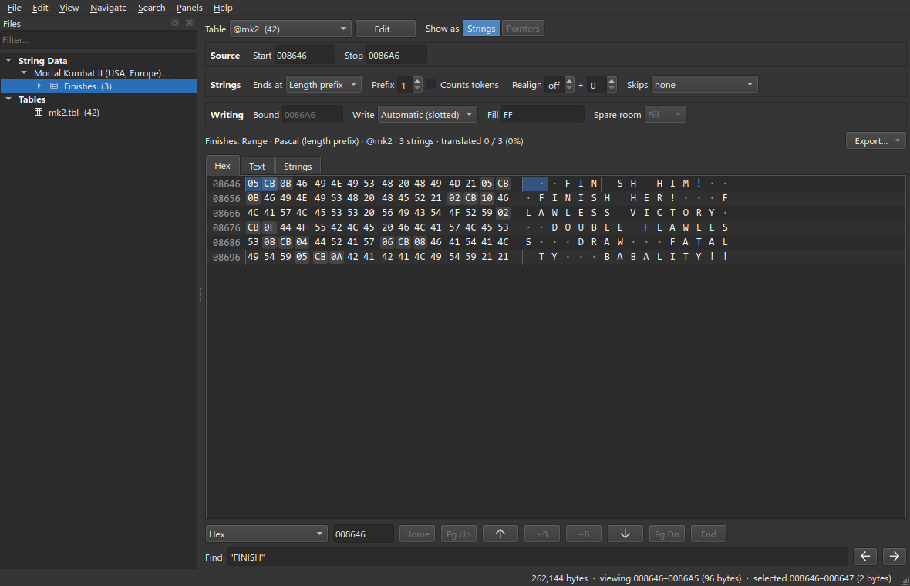

The first string now reads correctly, and the second one starts on the next
record's header, which is the next thing to skip:

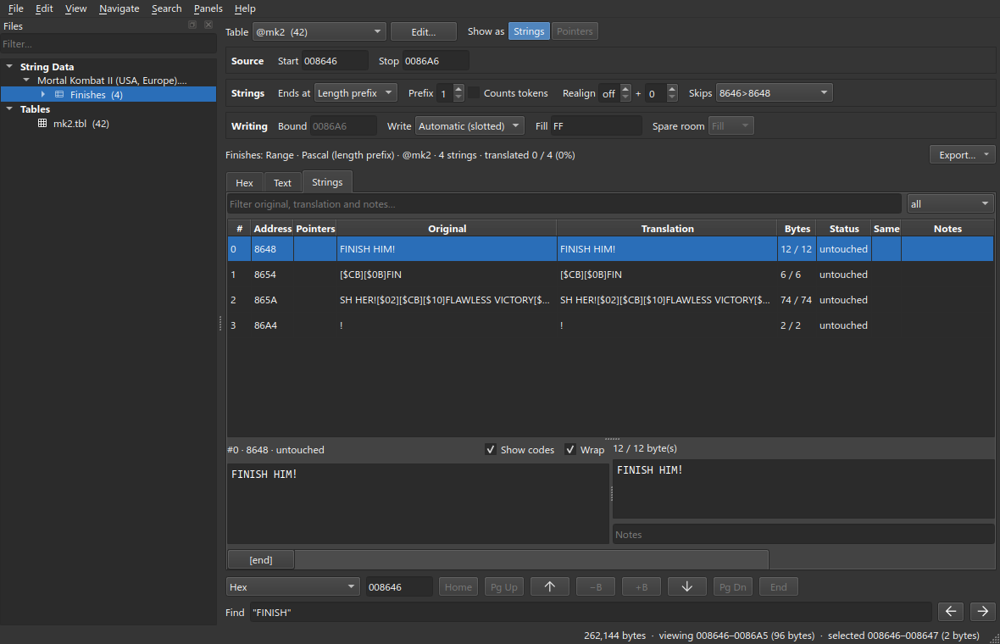

Repeat for the other six headers — `$8654`, `$8662`, `$8675`, `$8687`,
`$868E`, `$8699`. The Hex tab of a block shows only the block's bytes, so all
seven are on screen at once. The **Skips** list on the Reading bar shows the
ranges and edits them directly if you would rather type them.


Seven strings. **Original** is the text as it was when the block was made,
which the project keeps; **Translation** is what the bytes say *now*;
**Bytes** is how many the string uses out of how many it may.

Note the **Writing** section: *Automatic (slotted)*. A block with no pointers
cannot move its strings, so each stays at its address and may use only its
own slot — `FINISH HIM!` has 12 bytes (the length byte and 11 characters) and
no more. Step 9 runs into this.

## 5. A Pointers block: Fighter names

The second block is read through a **pointer table**: a list of addresses in
the ROM that says where each string starts. A block that knows its pointers
can move its strings and rewrite the pointers to match, so one name can grow
as long as another shrinks.

### Start with the strings

Click the ROM in the Files panel to get back to the whole file, and go to
`$8DE0` (type it in the address field under the tabs). The names run from
`KANG` at `$8E02` to the `00` after `JADE` at `$8E4D`. Select that:


**New Block**, rename it `Fighter names`. The file's reading is still *End
token*, and these strings do end in `00`, so this one reads correctly at
once — twelve names, as a plain range:


### Find the pointers

With the block open, **Search ▸ Find Pointers…** (Ctrl+Shift+P). The first
dialog asks what to look for and which **offsets** to try.

The offset matters here. A Game Boy maps 16 KB of the ROM at a time into CPU
addresses `$4000–$7FFF`. This text sits in the ROM's third 16 KB (bank 2),
which is file `$8000–$BFFF`, so the game's pointer to `KANG` does not say
`$8E02`; it says `$4E02`. File offset = pointer + `$4000`. Type `4000` as
both ends of the offset range.


The search computes what a pointer to each string would look like under every
mapping, size and byte order, and looks for those bytes in the file.


The first row explains all 12 strings with 2-byte little-endian pointers, 2
bytes apart, at `$8DE9–$8DFF` — directly in front of the names, where you
would expect a table to be. **Use as Pointer Table** turns the block's source
into that table. (**Attach** keeps the block a range and only notes on each
string which pointers reach it, for games whose pointers are scattered.)

### Give it room

One more setting. In the Reading bar's **Writing** section, type `8E4E` into
**Bound**: the address the block's strings must stay in front of. `$8E4E` is
the first byte after `JADE`'s `00`, and it is program code, so nothing may
spill into it. Without a bound of its own, the block's room ends wherever its
last string currently ends, and bytes freed by a shorter name would be lost
to the others.


The Reading bar now has a **Pointers** section describing the table, every
string lists the address of its pointer, and **Writing** has become
*Automatic (packed)*: on an edit the strings are laid end to end from `$8E02`
up to the bound, and every pointer is rewritten to where its string landed.

## 6. Hex, Text and Strings: three views of a block

The three tabs show the same bytes three ways, and a block confines all of
them to its own bytes. Ctrl+1, Ctrl+2 and Ctrl+3 switch between them.

### Finishes

**Hex** — bytes on the left, each decoded through the table on the right. The
skipped headers and the length bytes are not text and show as dots.

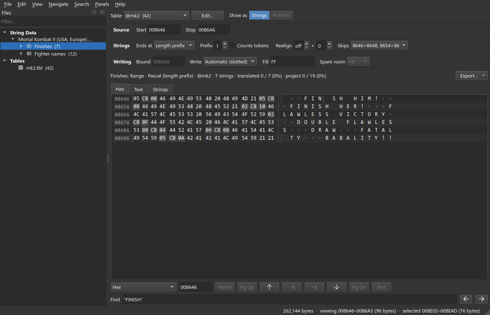

**Text** — the bytes as one run of text, unmatched bytes as `[$xx]` codes.
This is the view for reading what is around a string, and for spotting
structure like the three bytes before each of these.

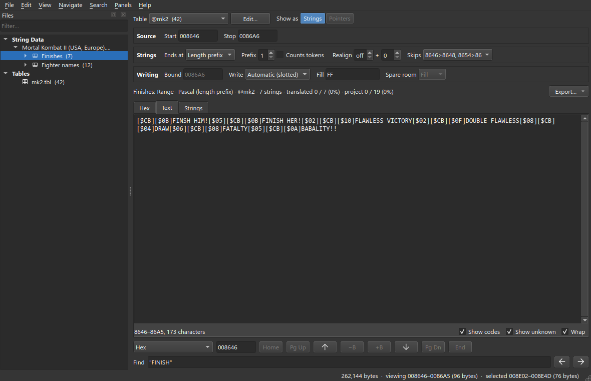

**Strings** — the block cut into strings by its rules: the editing surface.
The pane under the grid shows the selected string whole, original on the
left, translation on the right.

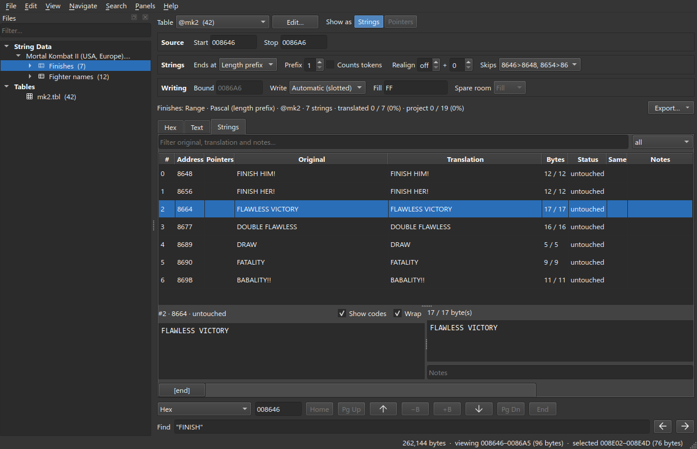

### Fighter names

A pointer block has two things to show, and **Show as** on the Format bar
picks which. **Pointers** shows the table itself; the Hex tab marks each
pointer and says where it leads.

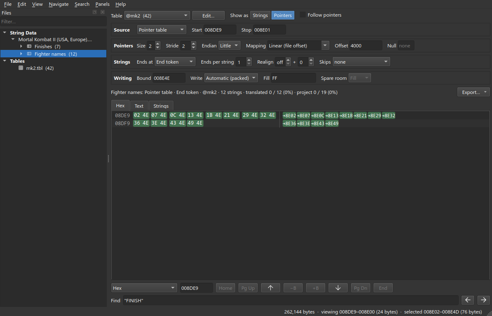

**Strings** shows the bytes the pointers reach.

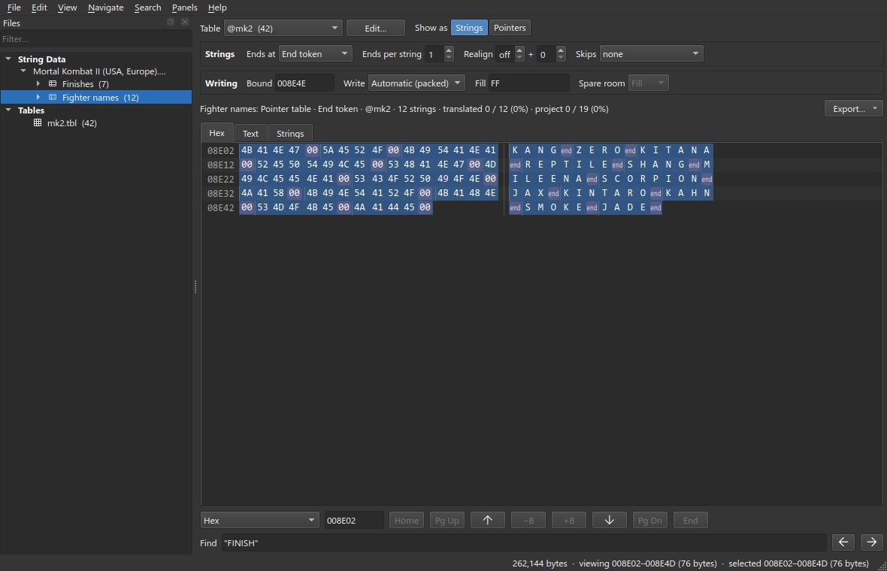

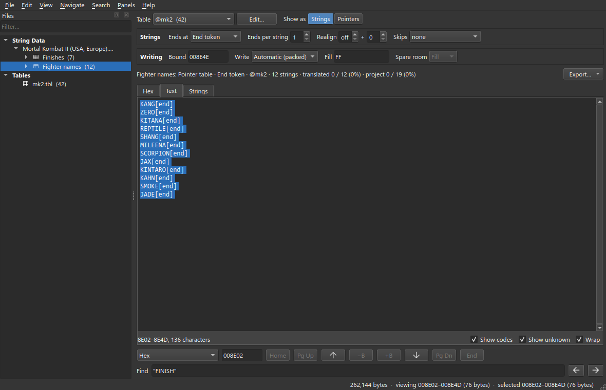

**Panels ▸ Hex** adds a hex dump under any view. It follows the selection, so
in the Strings tab it shows the bytes of the string you are on:

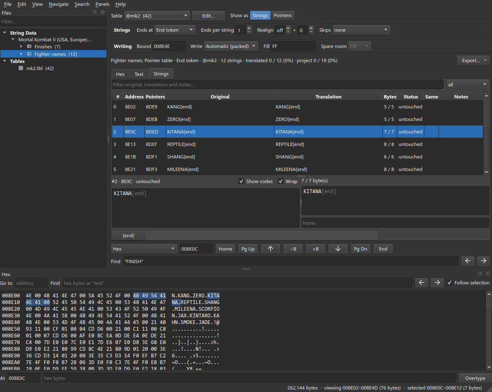

## 7. Build `mk2-translated.tbl`

The game draws a character by using its code to pick a tile from the font.
It has tiles for `A`–`Z`, the digits and a little punctuation, and nothing
else, so a Russian translation cannot add codes; it has to **reuse the 26
letter codes** and redraw the tiles behind them. The translated table is the
plan for that: which code will *look like* which Cyrillic letter once the font
is redrawn.

Russian has 33 letters and there are 26 slots, so the table is a choice.
Two rules make it a good one:

- **Keep the lookalikes where they are.** `A B C E H K M O P T X Y` already
  look like `А В С Е Н К М О Р Т Х У`. Those twelve tiles need no redrawing.
- **Give the other fourteen slots to the letters the script uses most**, and
  write the translation with what you have.

| Code | Latin | Cyrillic | | Code | Latin | Cyrillic |
| --- | --- | --- | --- | --- | --- | --- |
| `41` | A | А | | `4E` | N | П |
| `42` | B | В | | `4F` | O | О |
| `43` | C | С | | `50` | P | Р |
| `44` | D | Д | | `51` | Q | Ч |
| `45` | E | Е | | `52` | R | Я |
| `46` | F | Ф | | `53` | S | Б |
| `47` | G | Г | | `54` | T | Т |
| `48` | H | Н | | `55` | U | Ь |
| `49` | I | И | | `56` | V | Ж |
| `4A` | J | Й | | `57` | W | Ш |
| `4B` | K | К | | `58` | X | Х |
| `4C` | L | Л | | `59` | Y | У |
| `4D` | M | М | | `5A` | Z | З |

That leaves out `Ё Ц Щ Ъ Ы Э Ю`. The two blocks translated here do not need
them. A whole-game translation would — by freeing more tiles, or by changing
the code that draws text, both beyond a table.

**File ▸ New Table…**, `mk2-translated.tbl`. In **Fill…** choose **Custom…**,
type the 26 letters in code order, and start at `41`:

```
АВСДЕФГНИЙКЛМПОРЧЯБТЬЖШХУЗ
```

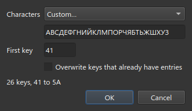

> These must be **Cyrillic** letters, even the twelve that look Latin. The
> table maps what you will *type* in a translation, and you will be typing on
> a Russian layout.

Then the same digits, punctuation and `[end]` entry as `mk2.tbl`, and
**Save**.

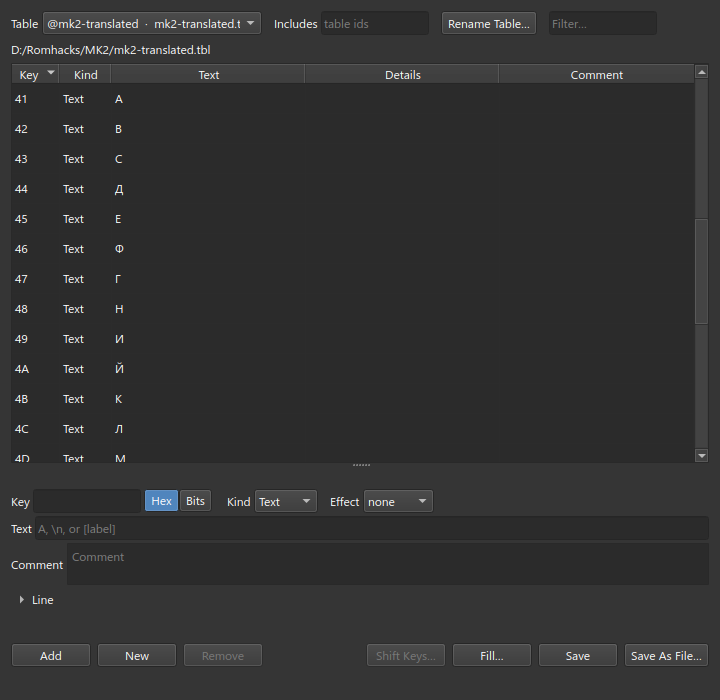

## 8. Redraw the font

The table is a promise that code `53` draws `Б`. Until the font is edited it
still draws `S`, and everything translated in step 9 shows up in the game as
Latin nonsense — `ДОБЕЙ ЕГО!` as `DOSEJ EGO!`. Changing the tiles is graphics
work, which mapchar does not do; this is the outline of it.

1. **Find the font.** Open the ROM in a tile editor (celPix, YY-CHR, Tile
   Molester) as Game Boy 2bpp and page through it for the alphabet. An
   emulator's VRAM viewer, opened while the text is on screen, shows the tiles
   as the game loaded them and confirms which tile each code picks.
2. **If it is not there, it is packed.** This game is an example: paging
   through it turns up no alphabet, and most of its graphics are compressed
   with Rob Northen's ProPack — 29 streams, each starting with the bytes
   `RNC` `02`. A font that cannot be found as plain tiles is in one of those.
   A packed font has to be unpacked with an RNC tool, edited as a
   loose file, packed again, and put back where it came from — and the new
   stream must not be longer than the old one, for the same reason a string
   must fit its slot.
3. **Expect more than one font.** Text drawn by different routines can use
   different tiles. Here the fight announcements and the names over the
   health bars are drawn by separate code, so check both on screen after
   changing either.
4. **Redraw only what the table changed.** Fourteen tiles: the ones behind
   `D F G I J L N Q R S U V W Z` become `Д Ф Г И Й Л П Ч Я Б Ь Ж Ш З`, in the
   same cell size and at the same weight as the originals. The twelve
   lookalikes stay.
5. **Everything shares the font.** Every string in the game that is still
   English now draws in Cyrillic lookalikes — `ROUND 1` becomes `ЯОЬПД 1`.
   Redrawing the font commits you to translating everything that uses it.

Steps 8 and 9 do not depend on each other, and either can come first. Until
both are done the game looks wrong, in one of two ways.

## 9. Translate the strings

### Switch the blocks to the new table

Open **Finishes**, and in the **Table** list pick **@mk2-translated**.

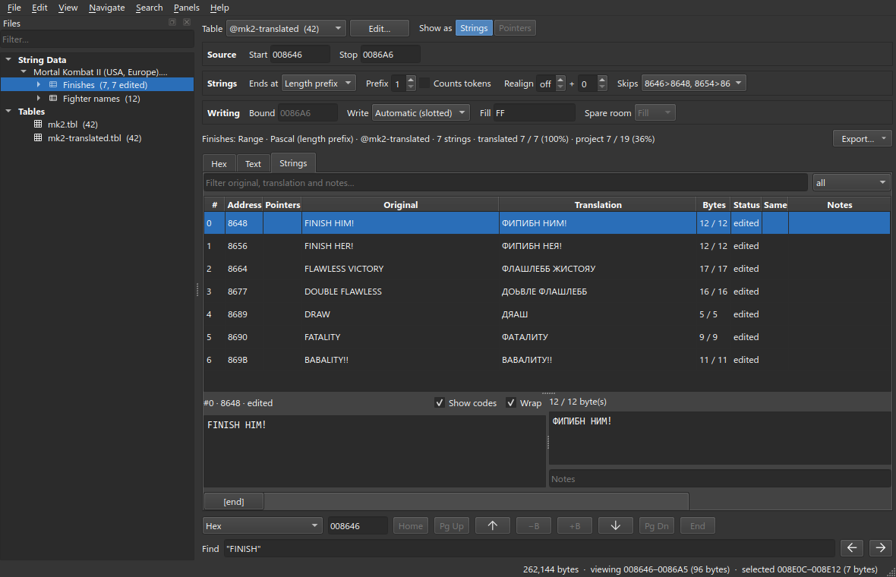

This looks alarming and is correct. Nothing in the ROM changed. The
**Translation** column shows what the bytes say *through the block's table*,
and the same bytes `46 49 4E 49 53 48` that read `FINISH` through `mk2` read
`ФИПИБН` through `mk2-translated` — which is exactly what the game would draw
with the redrawn font. **Original** is kept by the project and stays English.
Because the two columns now differ, every string counts as *edited* and the
block as 100 % translated before you have typed a word; use the Status column
as a guide only after this point, or mark strings **done** as you go
(Ctrl+Alt+D).

### Type the translations

Double-click a **Translation** cell (or press F2, or just start typing), or
select a row and type in the pane under the grid. Enter commits and moves to
the next row; Ctrl+Enter commits and stays. Each edit is encoded
through the table, checked against the room the string has, and put into the
ROM's bytes in memory; Ctrl+Z takes it back.

| Original | Translation |
| --- | --- |
| FINISH HIM! | ДОБЕЙ ЕГО! |
| FINISH HER! | ДОБЕЙ ЕЕ! |
| FLAWLESS VICTORY | ЧИСТАЯ ПОБЕДА |
| DOUBLE FLAWLESS | ДВОЙНАЯ ЧИСТАЯ |
| DRAW | ПАТ |
| FATALITY | ФАТАЛИТИ |
| BABALITY!! | БАБАЛИТИ!! |

### When a string does not fit

`DRAW` wants to be `НИЧЬЯ`, and that is refused:

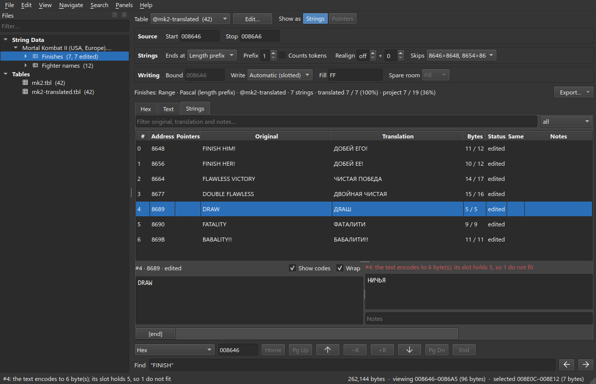

*The text encodes to 6 bytes; its slot holds 5.* Finishes is **slotted**:
`DRAW` owns a length byte and four characters, the next record starts right
after it, and mapchar never moves anything to make room. A refused edit
changes nothing. The fix is the translator's — a shorter word. `ПАТ` fits.

A translation *shorter* than the original is fine: the length byte is
rewritten and the leftover bytes are padded with the block's **Fill**. It
will sit a little off-centre on screen, since the position bytes in front of
each record were tuned to the English text. They are ordinary bytes; the
**Hex panel** can overtype them.


### Fighter names

Open **Fighter names**, switch it to **@mk2-translated** too, and translate.
Each string keeps its `[end]`; the button row under the pane inserts codes so
you need not type them.

| Original | Translation | | Original | Translation |
| --- | --- | --- | --- | --- |
| KANG | КАНГ | | SCORPION | СКОРПИОН |
| ZERO | ЗИРО | | JAX | ДЖАКС |
| KITANA | КИТАНА | | KINTARO | КИНТАРО |
| REPTILE | РЕПТАЙЛ | | KAHN | КАН |
| SHANG | ШАНГ | | SMOKE | СМОУК |
| MILEENA | МИЛИНА | | JADE | ДЖЕЙД |

`ДЖАКС` is two letters longer than `JAX`, and it fits. This block is
**packed**: its strings share all the room from `$8E02` to the bound, so the
bytes that `ШАНГ`, `МИЛИНА` and `КАН` gave up are there for `ДЖАКС` and
`ДЖЕЙД` to take. The order matters — shorten first, lengthen after — because
each edit has to fit at the moment it is made. The **Bytes** column's tooltip
says how much spare room the block has left.

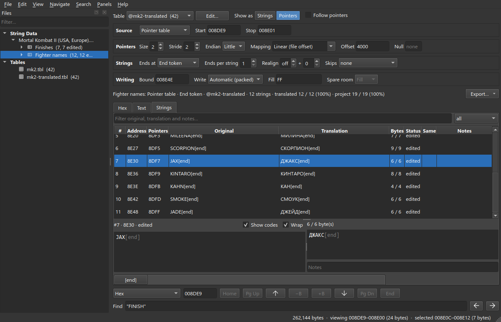

The total here comes to exactly the 76 bytes the English names used, which is
why `REPTILE` became `РЕПТАЙЛ` rather than the longer `РЕПТИЛИЯ`.

## 10. Write the ROM

So far every edit is in memory, and the ROM file on disk is untouched. **File ▸ Write All** (Ctrl+Shift+W) writes
every file with edits; **File ▸ Write** (Ctrl+W) writes the one on screen.

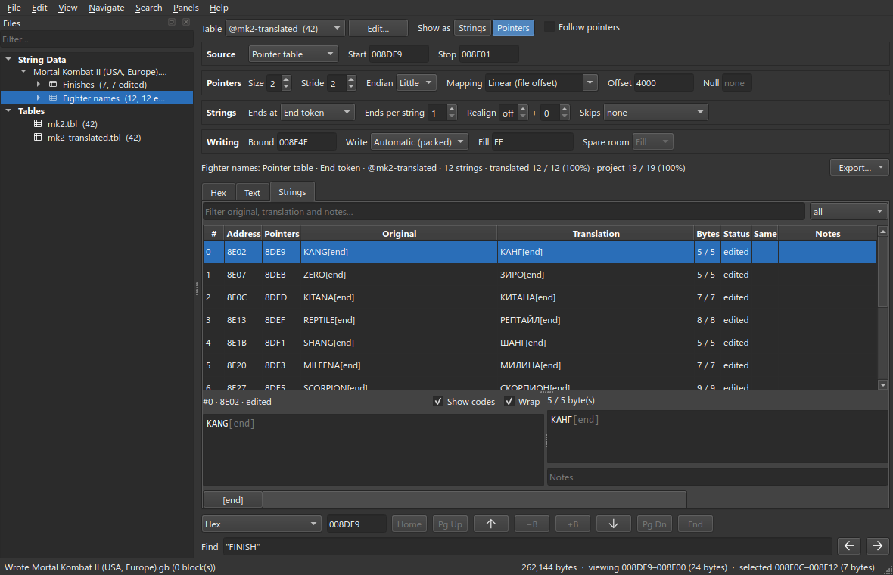

A write is an undo step like any other: Ctrl+Z puts the old bytes back in the
file. Then **File ▸ Save Project** (Ctrl+S) — the project holds the blocks,
their settings and the original English, which is what lets you come back to
this later.

Click the ROM and look at `$8DE0` through the *original* table, `mk2`, to see
what was written:


The names have moved — `ЗИРО` still starts at `$8E07`, but `МИЛИНА` is now at
`$8E20`, one byte earlier than `MILEENA` was — and the pointer table in front
of them was rewritten to match: the sixth pointer reads `20 4E` where it read
`21 4E`. Read through `mk2`, the text is `KAHG`, `ZIPO`, `KITAHA`: what an
emulator shows until the font from step 8 is in place, and the quickest proof
that the right bytes went to the right codes.

Run the ROM in an emulator and check every string you touched, on screen.

## Where to go from here

- **The rest of the game.** The Scan window's other regions are the menus,
  the story screens and the ending; they are made of the same two kinds of
  block.
- **Help ▸ Shortcuts…** (F1) lists every key, and **Help ▸ Legend…** every
  colour and mark the views draw.
- **Export ▸** on the Block bar writes a block's strings as TSV, CSV or PO
  for a translator who works elsewhere, and **File ▸ Import** reads them
  back.
